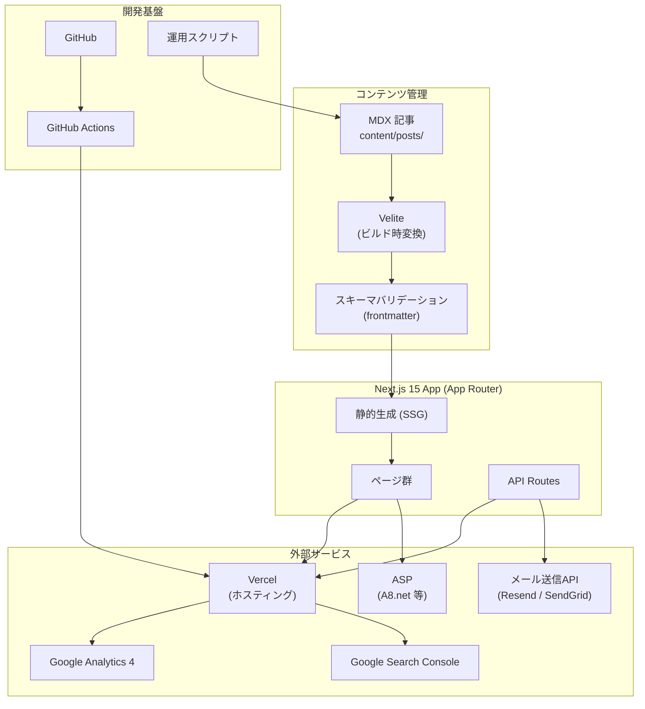
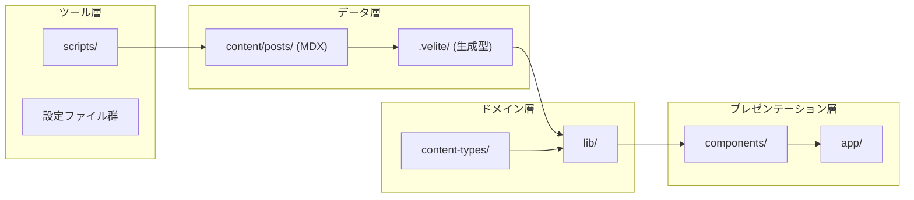
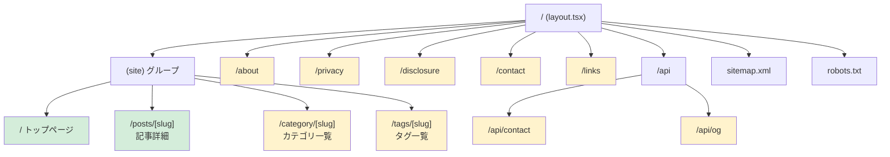
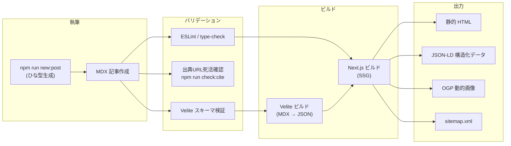
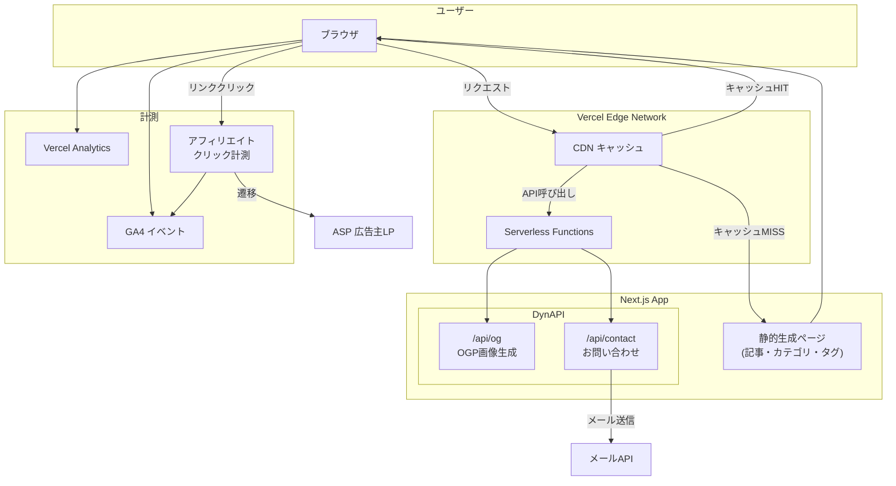
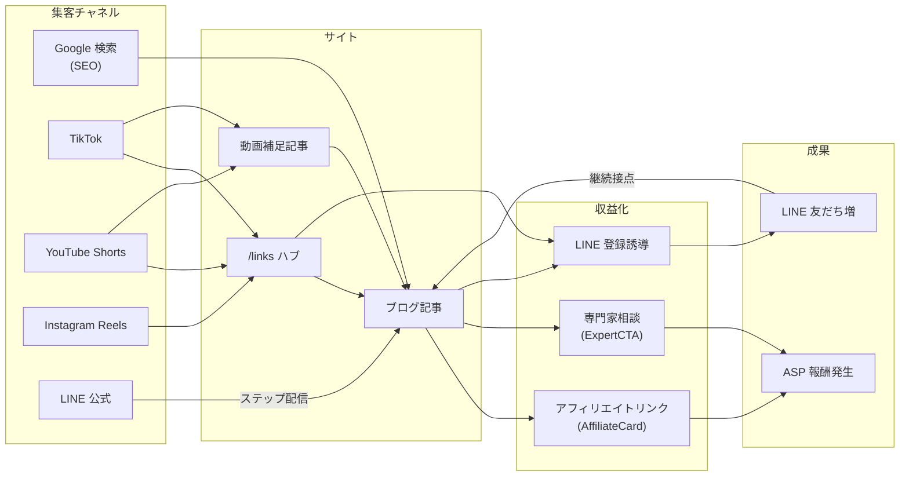
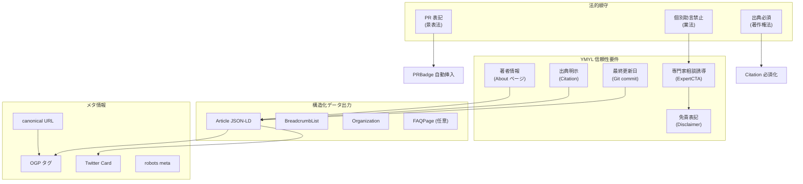
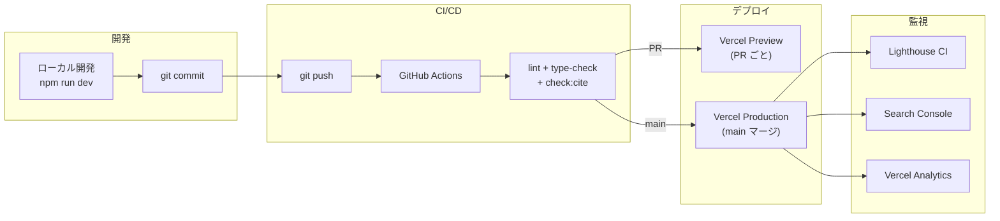

# アーキテクチャ図

> 最終更新: 2026-05-05

---

## 1. システム全体構成

---

## 2. ディレクトリ構造とレイヤー

---

## 3. ページルーティング構成

凡例: 🟢 実装済み / 🟡 スタブ・未完成

---

## 4. コンテンツパイプライン（ビルド時）

---

## 5. コンポーネント依存関係

```mermaid
graph TD
    subgraph Pages["ページ"]
        PostPage["posts/[slug]/page.tsx"]
        TopPage["(site)/page.tsx"]
        CategoryPage["category/[slug]/page.tsx"]
    end

    subgraph LayoutComp["レイアウトコンポーネント"]
        Header["Header.tsx"]
        Footer["Footer.tsx"]
        MobileNav["MobileNav.tsx"]
        Breadcrumb["Breadcrumb.tsx"]
    end

    subgraph MDXComp["MDX コンポーネント"]
        Citation["Citation.tsx"]
        Disclaimer["Disclaimer.tsx"]
        Callout["Callout.tsx"]
        PRBadge["PRBadge.tsx"]
        AffiliateCard["AffiliateCard.tsx"]
        ExpertCTA["ExpertCTA.tsx"]
    end

    subgraph ArticleComp["記事コンポーネント"]
        PostCard["PostCard.tsx"]
        PostList["PostList.tsx"]
    end

    subgraph LibLayer["lib/"]
        Affiliate["affiliate.ts"]
        SEO["seo.ts"]
        JsonLD["jsonld.ts"]
        Navigation["navigation.ts"]
    end

    subgraph UI["shadcn/ui"]
        Card["Card"]
        Button["Button"]
        Badge["Badge"]
        Drawer["Drawer"]
    end

    PostPage --> Citation
    PostPage --> Disclaimer
    PostPage --> Callout
    PostPage --> PRBadge
    PostPage --> AffiliateCard
    PostPage --> ExpertCTA
    PostPage --> SEO
    PostPage --> JsonLD

    TopPage --> PostCard
    TopPage --> PostList
    CategoryPage --> PostCard

    AffiliateCard --> Affiliate
    Header --> Navigation
    Footer --> Navigation
    MobileNav --> Drawer
    PostCard --> Card
    PostCard --> Badge
    AffiliateCard --> Card
    AffiliateCard --> Button
```

---

## 6. データフロー（ランタイム）

---

## 7. 集客・収益フロー

---

## 8. SEO / YMYL 信頼性アーキテクチャ

---

## 9. デプロイメントフロー

---

## 10. 技術スタック一覧

| レイヤー | 技術 | 用途 |
|---------|------|------|
| フレームワーク | Next.js 15 (App Router) | SSG + API Routes |
| 言語 | TypeScript (strict) | 型安全性 |
| スタイル | Tailwind CSS v4 | ユーティリティCSS |
| UI | shadcn/ui | 再利用可能コンポーネント |
| コンテンツ | MDX + Velite | 型安全な記事管理 |
| フォント | Noto Sans JP + Geist | 日本語 + 英数字 |
| ホスティング | Vercel | エッジ配信 + Serverless |
| 解析 | Vercel Analytics + GA4 | トラフィック計測 |
| 検索 | Google Search Console | インデックス管理 |
| メール | Resend / SendGrid | お問い合わせ送信 |
| CI/CD | GitHub Actions | 自動テスト + デプロイ |
| OGP | @vercel/og (next/og) | 動的OG画像 |
